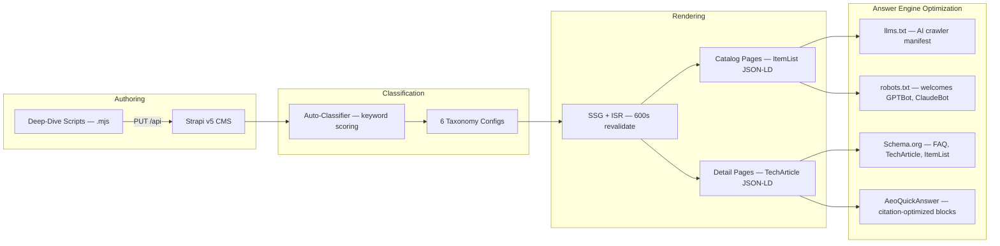
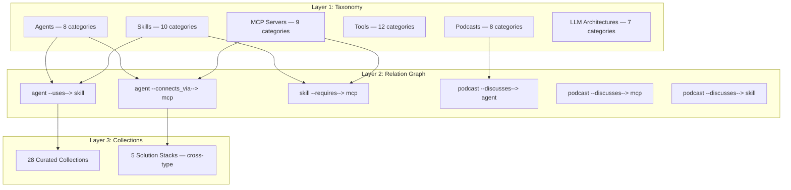

# Colaberry AI

<p align="center">
  <strong>The enterprise AI platform catalog. 2,500+ agents, skills, MCP servers, and tools. One knowledge graph.</strong><br>
  AEO-first architecture — built for AI answer engines, not just search engines.
</p>

<p align="center">
  <a href="https://colaberry.ai">
    
  </a>
  
  
  
  
  
  
  
</p>

---

## What It Does

Colaberry AI is a **catalog and knowledge graph** for the enterprise AI ecosystem. It organizes agents, skills, MCP servers, tools, podcasts, and LLM architectures into a queryable, cross-referenced platform — designed so AI answer engines (ChatGPT, Claude, Perplexity) can cite it directly.

Every piece of content lives in a **3-layer ontology**: Taxonomy (categories) -> Relation Graph (cross-type connections) -> Collections (curated bundles). A "Data Pipeline" skill links to the MCP servers it connects through, the agents that orchestrate it, and the podcast episodes that discuss it.

**This is not a marketing site.** It's an indexable knowledge base with 2,500+ structured entries, 52 LLM architecture deep dives, and 260+ podcast transcripts — all wired for machine consumption.

---

## Architecture

### System Overview

The platform is a Next.js frontend backed by a Strapi v5 headless CMS, deployed on GCP Cloud Run with ISR for real-time content updates.

```mermaid
graph TB
  subgraph Frontend["Next.js 16 Frontend"]
    SSG["SSG/ISR Pages — 53+ routes"]
    API_ROUTES["API Routes — leads, skills, cron"]
    AEO["AEO Layer — llms.txt, robots.txt, JSON-LD"]
  end
  subgraph CMS["Strapi v5 CMS"]
    CONTENT["Content Types — agents, skills, MCPs, tools, podcasts"]
    MEDIA["Media Library — covers, audio, transcripts"]
    NAV["Global Navigation — CMS-driven header/footer"]
  end
  subgraph Static["Static Data Layer"]
    TAXONOMY["6 Taxonomy Configs — 52 categories"]
    COLLECTIONS["28 Curated Collections"]
    STACKS["5 Solution Stacks — cross-type bundles"]
    LLM_DATA["52 LLM Architecture Specs"]
    DEEP_DIVES["52 Deep-Dive Articles — Strapi Dynamic Zone"]
    DEMOS["Demo Registry — typed config per demo"]
  end
  subgraph Distribution["Distribution Pipeline"]
    ORCH["Orchestrator — channel * source * template"]
    CLIENTS["Clients — X/Twitter, Moltbook, HuggingFace"]
    LOGS["Distribution Logs — Strapi persistence"]
  end
  subgraph Infra["GCP Cloud Run"]
    PROD["colaberry-ai-prod — frontend"]
    CMS_PROD["colaberry-ai-cms-prod — Strapi"]
    VTON["goggles-vton-poc — demo service"]
  end
  SSG -->|fetchCMSJson| CONTENT
  SSG -->|import| TAXONOMY
  SSG -->|import| COLLECTIONS
  SSG -->|import| LLM_DATA
  API_ROUTES -->|fetchCMSJson| CONTENT
  AEO -->|live stats| CONTENT
  ORCH -->|source| CONTENT
  ORCH -->|dispatch| CLIENTS
  ORCH -->|persist| LOGS
  PROD --- SSG
  CMS_PROD --- CONTENT
```



### Content Pipeline

Six content types flow through a shared pipeline: CMS authoring -> taxonomy auto-classification -> ontology graph -> ISR rendering -> AEO indexing.



### 3-Layer Ontology

Every content type follows the same knowledge graph pattern.



---

## Project Structure

```
src/
├── components/          # 48 React components
│   ├── Layout.tsx       # Header + footer + nav (1,800 lines)
│   ├── HeroGraphBloom.tsx   # SVG knowledge-graph constellation
│   ├── KineticHeading.tsx   # Word-by-word heading reveal
│   ├── SectionHeader.tsx    # Standardized section headers
│   ├── ContentTypeIcon.tsx  # Premium SVG icons per type
│   ├── AeoQuickAnswer.tsx   # Answer-engine-optimized blocks
│   └── SubstackEmbedSignup.tsx  # Newsletter (5 touchpoints)
├── pages/               # 53+ pages (SSG/ISR)
│   ├── index.tsx        # Homepage — hero, catalog signals, FAQ JSON-LD
│   ├── aixcelerator/    # Catalog pages — agents, skills, mcps, tools
│   │   ├── agents/      # Listing + [slug] detail + ontology
│   │   ├── skills/      # Listing + [slug] detail + ontology
│   │   ├── mcp-servers/ # Listing + [slug] detail + ontology
│   │   └── tools/       # Listing + [slug] detail + ontology
│   ├── resources/       # Podcasts, articles, LLM architectures
│   ├── industries/      # 8 domain-specific workspaces
│   ├── demo/            # Interactive AI demos (hub + [slug] + lens)
│   ├── api/             # API routes — leads, skills, cron, distribution
│   ├── llms.txt.ts      # AI crawler manifest (live stats)
│   ├── llms-full.txt.ts # Complete content index
│   └── robots.txt.ts    # Welcomes GPTBot, ClaudeBot, PerplexityBot
├── lib/                 # 26 utility modules
│   ├── cms.ts           # CMS fetch layer (cache, dedup, auth retry)
│   ├── ontologyTypes.ts # Shared type system
│   ├── ontologyRegistry.ts  # Cross-type relation definitions
│   ├── graphUtils.ts    # Graph data builder for visualizations
│   ├── bot-defense.ts   # 9-layer form protection (AEO-safe)
│   └── distribution/    # Catalog distribution pipeline
├── data/                # 21 static data files
│   ├── *-taxonomy.ts    # 6 taxonomy configs (52 categories total)
│   ├── *-collections.ts # 5 collection files (28 bundles)
│   ├── solution-stacks.ts   # Cross-type stacks
│   ├── llm-architectures.ts # 52 model specs
│   ├── demos.ts         # Demo registry
│   └── caseStudies.json # Industry case studies
├── styles/
│   └── globals.css      # Design tokens + component classes
└── hooks/               # Custom React hooks

scripts/
├── deep-dives/          # 52 LLM architecture deep-dive articles (.mjs)
├── author-llm-deep-dive.mjs  # CLI to publish deep dives to Strapi
└── seed-distribution-channels.mjs  # CMS channel seeder
```

---

## Quick Start

```bash
git clone https://github.com/colaberry/colaberry-ai.git
cd colaberry-ai
npm install
npm run dev
```

Open [http://localhost:3000](http://localhost:3000).

### Environment Variables

| Variable | Required | Description |
|----------|----------|-------------|
| `NEXT_PUBLIC_CMS_URL` | Yes | Strapi CMS URL (e.g. `http://localhost:1337`) |
| `CMS_API_TOKEN` | Yes (build) | Strapi API token for SSG data fetching |
| `NEXT_PUBLIC_SITE_URL` | No | Public site URL (default: `https://colaberry.ai`) |
| `NEXT_PUBLIC_VTON_DEMO_URL` | No | Virtual try-on demo service URL |
| `CATALOG_DISTRIBUTION_SECRET` | No | Bearer auth for distribution cron |
| `CATALOG_DISTRIBUTION_LIVE` | No | Set `true` for live social posting |

### Docker

```bash
# Frontend only (uses cloud CMS)
docker compose up frontend

# Full stack with local CMS
docker compose --profile with-cms up
```

### Build & Validate

```bash
npm run build        # Full production build — must pass with 0 errors
npm run lint         # ESLint
npx tsc --noEmit     # TypeScript type check
```

---

## Content Types

Six primary content types, each with taxonomy, ontology graph, and collections pages.

| Type | Count | Taxonomy Categories | Routes |
|------|-------|-------------------|--------|
| **Agents** | 160+ | 8 (Code, Content, Data, Research, Sales, Ops, Support, Other) | `/aixcelerator/agents` |
| **Skills** | 500+ | 10 (Development, AI, Research, Data, Business, Testing, Productivity, Security, Infra, Other) | `/aixcelerator/skills` |
| **MCP Servers** | 1,500+ | 9 (Database, Communication, DevTools, AI/ML, Cloud, Search, File, Monitoring, Other) | `/aixcelerator/mcp-servers` |
| **Tools** | 200+ | 12 (Communication, Database, Storage, DevTools, Analytics, AI, CRM, Marketing, Productivity, Search, Cloud, Other) | `/aixcelerator/tools` |
| **Podcasts** | 260+ | 8 (AI/ML, Business, Technology, Data, Education, Industry, Product, Other) | `/resources/podcasts` |
| **LLM Architectures** | 52 | 7 (Dense, MoE, Hybrid, Recurrent, Efficient, Long-Context, Other) | `/resources/llm-architectures` |

Each content type has:
- **Listing page** with search, category filters, and `ItemList` JSON-LD
- **Detail page** with `TechArticle` JSON-LD and `AeoQuickAnswer` blocks
- **Taxonomy page** — category breakdown with counts
- **Relation graph** — interactive cross-type connections
- **Collections page** — curated bundles by use case

---

## Answer Engine Optimization (AEO)

The site is built for AI answer engines first, search engines second.

| Feature | Route / File | Purpose |
|---------|-------------|---------|
| `/llms.txt` | `src/pages/llms.txt.ts` | Dynamic AI crawler manifest with live CMS stats |
| `/llms-full.txt` | `src/pages/llms-full.txt.ts` | Complete content index with summaries |
| `robots.txt` | `src/pages/robots.txt.ts` | Explicitly welcomes GPTBot, ClaudeBot, PerplexityBot |
| FAQ Schema | `src/pages/index.tsx` | `FAQPage` JSON-LD for direct AI citation |
| Quick Answers | `AeoQuickAnswer.tsx` | Citation-optimized paragraphs on catalog pages |
| TechArticle | Detail pages | Full `articleBody`, `wordCount`, `citation` arrays |
| ItemList | Listing pages | Structured catalog for AI parsing |

**Example:** When an AI answer engine processes `/llms.txt`, it gets a structured overview of the entire platform with live catalog counts, content type descriptions, and discovery URLs — no crawling required.

---

## Interactive Demos

Client-facing AI demos live under `/demo`. The surface is intentionally thin — adding a new demo requires only a config entry.

| Route | Demo | Status |
|-------|------|--------|
| `/demo` | Hub — lists all demos | Live |
| `/demo/goggle-vton` | Goggle Virtual Try-On detail page | Live |
| `/demo/lens` | VTON iframe embed (production share link) | Live |

**Adding a demo:** Add one record to `src/data/demos.ts`. The hub and detail pages pick it up automatically. Schema.org `WebApplication` JSON-LD is emitted per demo.

---

## Design System

**Monochrome + Coral Accent.** Zinc scale for all chrome, coral `#DC2626` for CTAs only.

| Token | Light | Dark |
|-------|-------|------|
| Background | `#FFFFFF` | `#09090B` zinc-950 |
| Surface | `#FAFAFA` zinc-50 | `#18181B` zinc-900 |
| Text primary | `#18181B` zinc-900 | `#FAFAFA` zinc-50 |
| Text muted | `#52525B` zinc-600 | `#A1A1AA` zinc-400 |
| Border | `#E4E4E7` zinc-200 | `#3F3F46` zinc-700 |
| Accent (coral) | `#DC2626` | `#F87171` |

**Font:** Inter (all weights). **Dark mode default.** Toggle via `.dark` class on `<html>`.

**Forbidden colors:** No `emerald-*`, `green-*`, `blue-*`, `amber-*`, `slate-*` in page code.

See [STYLE.md](STYLE.md) for the complete design token reference.

---

## Distribution Pipeline

Automated catalog distribution to social platforms via a daily cron.

```
CMS Content -> Source (per-kind isolation) -> Templates (Mustache) -> Clients -> Logs
```

| Platform | Status | Client |
|----------|--------|--------|
| X/Twitter | Live | OAuth 1.0a HMAC-SHA1 |
| Moltbook | Live | Bearer auth |
| HuggingFace | Stub (dry-run) | Deferred |
| Dev.to, Reddit, Discord, etc. | Planned | `skipped: not-implemented` |

**DRY_RUN by default.** Live posting requires `CATALOG_DISTRIBUTION_LIVE=true`.

---

## Deployment

### GCP Cloud Run

| Service | Branch | Domain |
|---------|--------|--------|
| `colaberry-ai-prod` | `Release-1.0` | colaberry.ai |
| `colaberry-ai-cms-prod` | — | CMS backend |
| `goggles-vton-poc` | — | Demo service |

### Cloud Build

```bash
# Manual deploy
gcloud builds submit --config=cloudbuild.yaml \
  --substitutions=SHORT_SHA=$(git rev-parse --short HEAD),_CMS_API_TOKEN=<token>
```

The `release-1-0-colaberry-ai-prod` trigger fires on push to `colaberry/colaberry-ai` `Release-1.0` branch.

**Critical:** `CMS_API_TOKEN` must be passed as `--build-arg` for SSG pages to bake real data. Without it, pages build with `totalCount: 0` and wait for ISR regeneration (600s).

---

## Security

9-layer bot defense on all forms (AEO-safe):

1. User-agent filter (blocks curl/wget/headless — allows crawlers on GET)
2. Minimum UA length
3. Required browser headers (accept, accept-language, user-agent)
4. Origin/referer host allowlist
5. `application/json` content-type enforcement
6. Honeypot field
7. 5-second minimum HMAC timing token
8. Strict email validator with disposable-domain blocklist
9. Per-IP + per-email rate limits

All failures silently return 200 (anti-enumeration).

**10 security agents** for continuous auditing: secrets, XSS, rate limiting, auth, API, uploads, dependencies, pentest, WCAG 2.2, and Core Web Vitals.

---

## LLM Architecture Deep Dives

52 flagship articles authored via file-sourced pipeline:

```bash
# Publish a single deep dive
node scripts/author-llm-deep-dive.mjs --slug deepseek-v3

# Publish all 52
node scripts/author-llm-deep-dive.mjs --all

# Dry run (no Strapi writes)
node scripts/author-llm-deep-dive.mjs --slug llama-3-2-3b --dry-run
```

Each deep dive uses Strapi's Dynamic Zone with structured blocks (heading, paragraph, table, callout, code-block, references). The renderer (`LLMArchitectureDeepDive.tsx`) dispatches per `__component` type.

---

## Branch Strategy

| Branch | Purpose | Deploys to |
|--------|---------|-----------|
| `dev` | Active development | — |
| `Release-1.0` | Production release | colaberry.ai |

---

## Contributing

This is a private enterprise project. Internal contributors should follow the Spec-Driven Development workflow:

1. **Specify** — Write feature spec (`specs/<feature>/spec.md`)
2. **Plan** — Architecture plan (`plan.md`)
3. **Tasks** — Atomic task breakdown (`tasks.md`)
4. **Implement** — TDD + build validation

See `specs/README.md` and `Constitution.md` for architectural principles.

---

<p align="center">
  <strong>colaberry.ai</strong> — Enterprise AI catalog, built for machines and humans alike.
</p>
